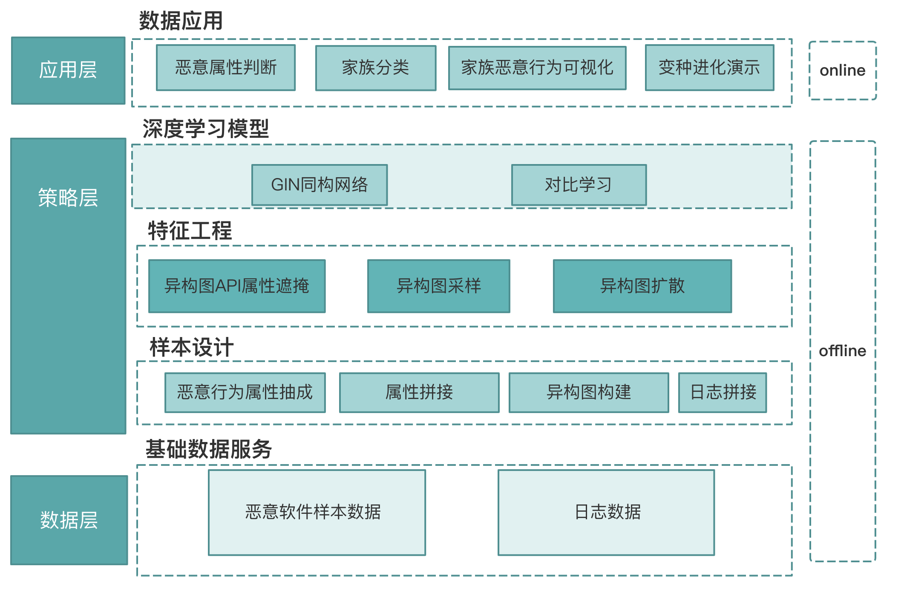
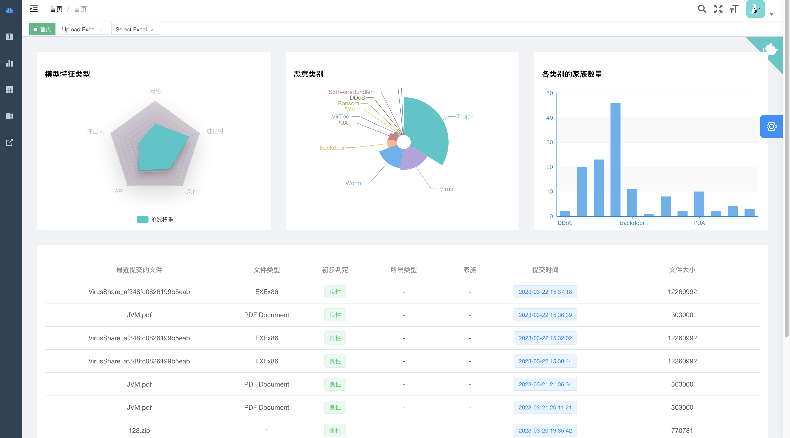
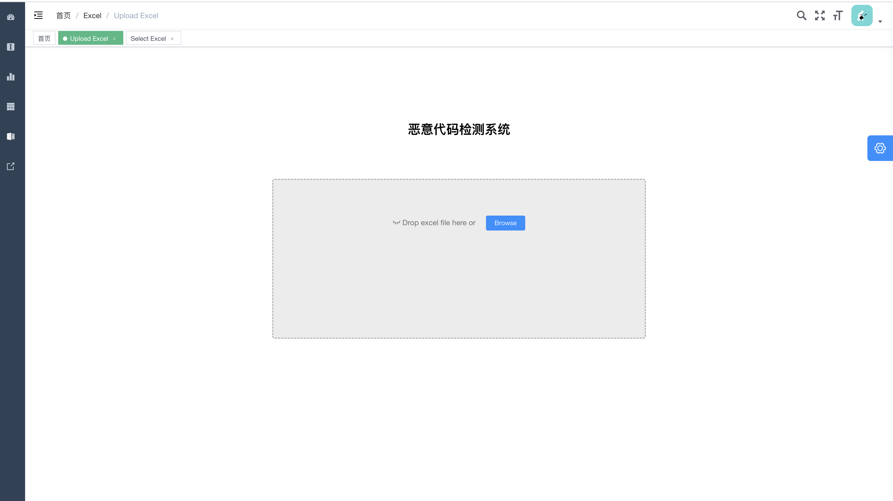
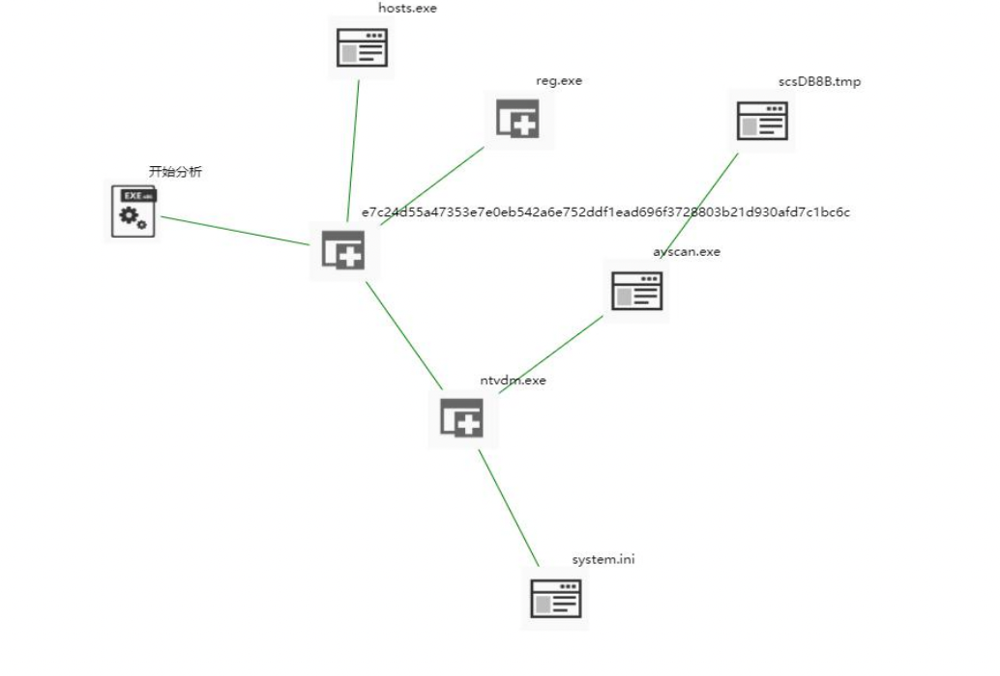

# Malware Detect System

## 1 产品介绍

恶意代码检测系统。

s
## 2 产品描述

## 2.1 产品功能

| 功能点            | 详细描述                                       |
|:---------------|:-------------------------------------------|
| **注册账号**       | 未注册用户注册成为产品用户，从而具备享有产品各项服务的资格              |
| **登录账号**       | 用户登录产品，获得产品提供的各项服务                         |
| **上传恶意样本**     | 用户可以将上传自己的收集到的恶意样本及其样本属性，网站会对该恶意样本进行保存     |
| **获取恶意样本检测结果** | 用户手动上传或使用oss方式上传待检测的恶意样本，系统检测样本后返回该样本属性    |
| **样本威胁分析报告**   | 系统返回用户根据检测结果，样本本身行为特征，并将其可视化。以报告的方式返回结果    |
| **训练检测模型**     | 系统每天固定时间点对恶意代码检测模型进行重新训练                   |
| **分类所有恶意样本**   | 系统可以每天固定时间点计算恶意样本之间的相似度信息，进而对所有样本进行大类、家族分类 |
| **更新恶意代码榜单**   | 用户可查看该系统过去一段时间检测过的文件以及相关分析结果               |
          |

## 2.2 产品约束

| 约束        | 约束解释                                                                 |
|:----------|:---------------------------------------------------------------------|
| **编程语言**  | 前端采用的语言为：HTML，CSS，JavaScript，前端采用的框架是：Vue；后端采用的语言为Golang，后端采用的框架为Gin |
| **响应时间**  | 网页的响应时间应在1s以内（存疑）                                                    |
| **算法模型**  | 算法训练的恶意代码检测模型的训练时间在2个小时以内，能对足够多种恶意代码家族种类进行检测，响应时间控制1分钟以内             |
| **界面友好性** | 产品的界面应能体现对用户用户好性，具有一定的美观性                                            |
| **代码可读性** | 产品的的代码应符合命名规范，命名与实际意义挂钩，具有可读性                                        |
| **代码健壮性** | 产品的代码应避免过度耦合，以便后续迭代优化，对现有功能的扩展以及增添新的功能                               |
| **项目计划**  | 产品的研发应严格遵循项目的管理流程，各阶段任务应避免延期，对后续阶段的开发造成影响                            |

## 3. 具体需求

## 3.1 外部接口需求

### 3.1.1 用户界面

1. 注册登陆界面

（扎心了，这一段还没有写前端log out的逻辑）

2. 首页

3. 上传恶意代码界面

4. 分析报告界面

5. 恶意代码行为可视化界面

（扎心了，这一段还没有还没来及用element UI画一个动态的图出来，假装有一个这样的界面吧, 可视化内容大概长下面这个亚子）

### 3.1.2 软件接口

- MacOS 操作系统；
- Aapche Kafka；
- etcd v3.4.15；
- Nginx 1.19.8。

### 3.1.3 通信接口

HTTPS协议、TCP/IP协议。

## 3.2 功能需求

### 3.2.1 web模块

#### 3.2.1.1 注册账号
| **用例名**             | **注册账号**                                                                                                                        |
|---------------------|---------------------------------------------------------------------------------------------------------------------------------|
| **基本事件流**           | (1) 用户打开注册页面  (2) 用户填写密码，用户名等身份信息(A-1)(A-2)  (3) 用户点击注册按钮  (4) 系统验证该用户信息是否符合规范  (5) 系统验证该用户名是否被注册过  (6) 系统返回注册结果 |
| **备选事件流**           | A-1 用户信息不符合规范 (1) 系统提示信息不符合规范    (2) 用户重新输入  A-2 用户被注册过   (1) 系统提示用户用户名重复    (2) 用户重新输入                          |
| **补充约束 - 数据约束**  | (1) 密码不能为空  (2) 电话不能为空                                                                                                       |
| **补充约束 - 非功能需求** | 系统响应时间不超过15秒                                                                                                                    |

#### 3.2.1.2 登录账号

| **用例名**             | **注册账号**                                                                                                                                                                                                 |
|---------------------|----------------------------------------------------------------------------------------------------------------------------------------------------------------------------------------------------------|
| **基本事件流**           | (1) 用例起始于未登录用户想要登录系统  (2) 未登录用户点击【登录】按钮，系统跳转到登录页面(A-1)  (3) 用户在登录页面填入相关信息(D-1)，点击【登录】(A-2)(A-3)(A-4)                                                                                               |
| **备选事件流**           | A-1 系统繁忙或网络出现问题 (1) 系统提示：系统繁忙，请稍后再试 A-2 用户的账户未注册  (1) 系统提示：该账户不存在，请注册后再使用 (2) 系统跳转到注册页面 A-3 用户登录成功   (1) 系统提示：登录成功    (2) 系统跳转到主页或用户之前浏览的页面 A-4 用户登录失败 (1) 系统提示：登录信息不正确，请重新输入 |
| **补充约束 - 数据约束**  | D-1 提交的数据需要包含账户名，密码                                                                                                                                                                                      |
| **补充约束 - 非功能需求** | 无                                                                                                                                                                                                        |

#### 3.2.1.3 上传恶意样本
| **用例名**             | **注册账号**                             |
|---------------------|--------------------------------------|
| **基本事件流**           | (1) 点击上传  (2) 系统提示上传成功并修改数据库(A-1) |
| **备选事件流**           | A-1 系统繁忙或网络出现问题 系统提示：系统繁忙，请稍后再试   |
| **补充约束 - 数据需求**  | 提交数据包括用户字段和恶意样本                      |
| **补充约束 - 非功能需求** | 暂无                                   |

#### 3.2.1.4 获取恶意样本检测结果与样本威胁分析报告
| **用例名**         | 获取推荐                                                                     |
|-----------------|--------------------------------------------------------------------------|
| **基本事件流**       | (1) 用户注册后进入上传样本界面 (2) 可在页面上查看本次或历史检测结果(A-1) (3) 点击查看报告，可返回样本分析报告(A-2) |
| **备选事件流**       | A-1、A-2 系统繁忙或网络出现问题 系统提示：系统繁忙，请稍后再试                                      |
| **补充约束- 数据需求**  | 提交的数据包括用户字段和用户本次上传的样本id                                                  |
| **补充约束- 非功能需求** | 暂无                                                                       |

#### 3.2.1.5 更新恶意代码榜单
记录用户的检测记录

### 3.2.2 算法模块

训练生成模型、分类所有样本和样本预测三个部分

#### 3.2.2.1 训练生成模型
| **用例名**     | **训练生成模型**                                                                                |
| -------------- |-------------------------------------------------------------------------------------------|
| **基本事件流** | (1) 读取模型参数    (2) 恶意样本特征预处理    (3)构造出异构图, 并使用三种数据增强方式进行正负样本的生成     (4) 微调模型参数并保存 |

#### 3.2.2.2 分类所有样本

| **用例名**   | **分类所有样本**                                                          |
|-----------|---------------------------------------------------------------------|
| **基本事件流** | (1) 将样本构造成异构图的形式  (2) 加载既有的对比学习模型，生成异构图的表征  (3) 根据表征，对异构图进行分类 |

#### 3.2.2.3 样本预测

| **用例名**   | **分类所有样本**                                                              |
|-----------|-------------------------------------------------------------------------|
| **基本事件流** | (1) 将待预测的样本构造成异构图的形式  (2) 加载既有的对比学习模型，生成异构图的表征  (3) 根据表征，对异构图进行分类 |

### 3.2.3 调度模块

#### 3.2.3.1 触发训练任务

通过定时任务触发训练任务，将训练任务元数据序列化并存入任务队列

| **用例名**       | **分类所有样本**                                                                   |
|---------------|------------------------------------------------------------------------------|
| **基本事件流**     | （1）用例起始于每天凌晨02:00自动运行 （2）将待预测的样本编号序列化后，推送至任务队列  （3）从任务状态队列中轮训任务状态（A-2） |
| **补充约束-数据约束** | 元数据要求符合数据库约束，同时限制任务大小。                                                       |
| **补充约束-业务约束** | 任务提交失败时需要自动跳过错误数据并重试。                                                        |

